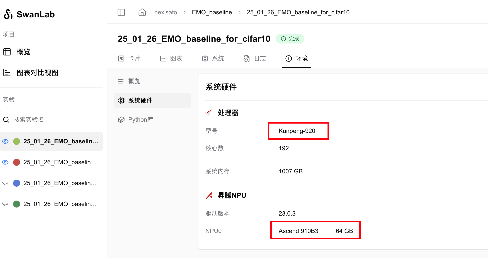

# System Hardware Monitoring (Supports Ascend)

During the tracking of experiments, SwanLab **automatically monitors** the hardware resources of the machine and records them in the **"System" charts**.

Currently, SwanLab supports monitoring hardware resources for three types of **AI computing chips** (**Huawei Ascend** 、**NVIDIA** 、**Cambricon**), covering metrics such as GPU utilization, VRAM usage, GPU temperature, and GPU power consumption.

In addition, SwanLab also supports monitoring hardware resources such as **CPU**, **memory**, and **disk**.

---

> We are thrilled to collaborate with the Ascend Computing team to offer trainers more opportunities to experience domestic computing power.

[Ascend NPU Monitoring Example](https://swanlab.cn/@nexisato/EMO_baseline/runs/lg1ky9or15htzkek3vv2h/system)

NPU Monitoring Charts:

AI Chip Environment Records:

---

## Detailed System Monitoring Metrics  

SwanLab automatically monitors hardware resource utilization on the machine running the experiment and generates charts for each metric, collectively displayed in the **"System" charts** tab.  

### **Sampling Strategy & Frequency**  
SwanLab dynamically adjusts hardware data sampling frequency based on experiment duration to balance data granularity and system performance. Sampling frequencies are tiered as follows:  

| Data Points Collected | Sampling Frequency |  
|:---------------------:|:------------------:|  
| 0~10                  | Every 10 seconds   |  
| 10~50                 | Every 30 seconds   |  
| 50+                   | Every 60 seconds   |  

SwanLab monitors GPU, NPU, CPU, system memory, disk I/O, and network metrics—all critical to the training process. Below is a detailed breakdown of each monitoring category and its visualization significance.  

---

### **1. GPU (NVIDIA)**  

> *On multi-GPU machines, each GPU's metrics are recorded separately and displayed as individual lines in charts.*  

| Metric | Description |  
|--------|------------|  
| **GPU Memory Allocated (%)** | Percentage of GPU VRAM utilization |  
| **GPU Memory Allocated (MB)** | VRAM usage in MB (chart Y-axis capped at max VRAM across GPUs) |  
| **GPU Utilization (%)** | Compute workload percentage |  
| **GPU Temperature (°C)** | GPU temperature in Celsius |  
| **GPU Power Usage (W)** | GPU power draw in watts |  

---

### **2. NPU (Ascend)**  

> *On multi-NPU systems, each NPU's metrics are logged independently.*  

| Metric | Description |  
|--------|------------|  
| **NPU Utilization (%)** | Compute workload percentage |  
| **NPU Memory Allocated (%)** | NPU memory utilization percentage |  
| **NPU Temperature (°C)** | NPU temperature in Celsius |  

---

### **3. MLU (Cambricon)**  

> *On multi-NPU systems, each NPU's metrics are logged independently.*  

| Metric | Description |  
|--------|------------|  
| **MLU Utilization (%)** | Compute workload percentage |  
| **MLU Memory Allocated (%)** | MLU memory utilization percentage |  

---

### **4. CPU**  

| Metric | Description |  
|--------|------------|  
| **CPU Utilization (%)** | Total CPU workload percentage |  
| **Process CPU Threads** | Number of threads used by the experiment |  

---

### **5. Memory**  

| Metric | Description |  
|--------|------------|  
| **System Memory Utilization (%)** | Total system RAM usage percentage |  
| **Process Memory In Use (non-swap, MB)** | Physical RAM actively used by the process (excludes swap) |  
| **Process Memory Utilization (MB)** | Total memory allocated to the process (includes swap) |  
| **Process Memory Available (non-swap, MB)** | Unused physical RAM available to the process |  

---

### **6. Disk**  

| Metric | Description |  
|--------|------------|  
| **Disk I/O Utilization (MB/s)** | Read/write speeds (separate lines for read vs. write) |  
| **Disk Utilization (%)** | System disk usage percentage: - Linux: Root partition (`/`) - Windows: System drive (typically `C:`) |  

---

### **7. Network**  

| Metric | Description |  
|--------|------------|  
| **Network Traffic (KB/s)** | Data transfer rates (separate lines for receive vs. transmit) |  