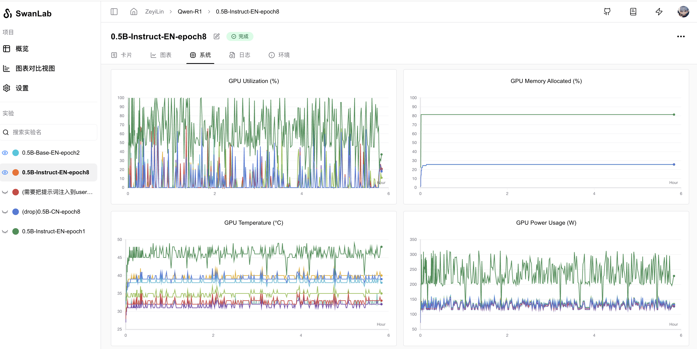

# 系统硬件监控

SwanLab在跟踪实验的过程中，会**自动监控**机器的硬件资源情况，并记录到 **「系统」图表** 当中。当前支持的硬件列表：

| 硬件 | 信息记录 | 资源监控 | 脚本 |
| --- | --- | --- | --- |
| 英伟达GPU | ✅ | ✅ | [nvidia.py](https://github.com/SwanHubX/SwanLab/blob/main/swanlab/data/run/metadata/hardware/gpu/nvidia.py) |
| 昇腾NPU | ✅ | ✅ | [ascend.py](https://github.com/SwanHubX/SwanLab/blob/main/swanlab/data/run/metadata/hardware/npu/ascend.py) |
| 寒武纪MLU | ✅ | ✅ | [cambricon.py](https://github.com/SwanHubX/SwanLab/blob/main/swanlab/data/run/metadata/hardware/mlu/cambricon.py) |
| 昆仑芯XPU | ✅ | ✅ | [kunlunxin.py](https://github.com/SwanHubX/SwanLab/blob/main/swanlab/data/run/metadata/hardware/xpu/kunlunxin.py) |
| CPU | ✅ | ✅ | [cpu.py](https://github.com/SwanHubX/SwanLab/blob/main/swanlab/data/run/metadata/hardware/cpu.py) |
| 内存 | ✅ | ✅ | [memory.py](https://github.com/SwanHubX/SwanLab/blob/main/swanlab/data/run/metadata/hardware/memory.py) |
| 硬盘 | ✅ | ✅ | [disk.py](https://github.com/SwanHubX/SwanLab/blob/main/swanlab/data/run/metadata/hardware/disk.py) |
| 网络 | ✅ | ✅ | [network.py](https://github.com/SwanHubX/SwanLab/blob/main/swanlab/data/run/metadata/hardware/network.py) |

## 系统监控指标详解

SwanLab 支持在当前实验运行的机器上自动监控硬件资源情况，并为每个指标生成图表，统一展示在 **「系统」图表** 选项卡中。

**采集策略与频率**：SwanLab根据当前实验的持续运行时间，自动调整硬件数据采集的频率，以平衡数据粒度与系统性能，采集频率分为以下几档：

| 已采集数据点数 | 采集频率 |
|   :---:   |   :---:   |
| 0~10    | 10 秒/次 |
| 10~50   | 30 秒/次 |
| 50+     | 60 秒/次 |

SwanLab 采集的硬件资源情况涵盖了GPU、NPU、CPU、系统内存、硬盘IO以及网络情况等多个与训练过程相关的指标。以下详细介绍每个部分的监控内容及其在图表展示中的意义。

## GPU（NVIDIA）

> 在多卡机器上，每个GPU的资源情况都会单独记录，最终在图表中展示多条图线。

| 指标 | 描述 |  
|--------|------------|  
| GPU Memory Allocated (%) | **GPU 显存使用率**，表示此GPU的显存占用百分比。|
| GPU Memory Allocated (MB) | **GPU 显存使用率**，表示此GPU的显存占用量，以MB为单位。该指标对应图表的纵坐标上限为所有GPU中的最大总显存。|
| GPU Utilization (%) | **GPU 利用率**，表示此GPU的计算资源占用百分比。|
| GPU Temperature (℃) | **GPU 温度**，表示此GPU的温度，以摄氏度为单位。|
| GPU Power Usage (W) | **GPU 功耗**，表示此GPU的功耗，以瓦特为单位。|
| GPU Time Spent Accessing Memory (%) | **GPU 内存访问时间**，表示此GPU在执行任务时，花费在访问 GPU 内存（显存）上的时间百分比。|

 

## NPU（Ascend）

> 在多卡机器上，每个NPU的资源情况都会单独记录，最终在图表中展示多条图线。

| 指标 | 描述 |  
|--------|------------|  
| NPU Utilization (%) | **NPU 利用率**，表示此NPU的计算资源占用百分比。|
| NPU Memory Allocated (%) | **NPU 显存使用率**，表示此NPU的显存占用百分比。|
| NPU Temperature (℃) | **NPU 温度**，表示此NPU的温度，以摄氏度为单位。|

 

## MLU（寒武纪）

> 在多卡机器上，每个MLU的资源情况都会单独记录，最终在图表中展示多条图线。

| 指标 | 描述 |  
|--------|------------|  
| MLU Utilization (%) | **MLU 利用率**，表示此MLU的计算资源占用百分比。|
| MLU Memory Allocated (%) | **MLU 显存使用率**，表示此MLU的显存占用百分比。|
| MLU Temperature (℃) | **MLU 温度**，表示此MLU的温度，以摄氏度为单位。|
| MLU Power (W) | **MLU 功率**，表示此MLU的功率，以瓦特为单位。|

 

## XPU（昆仑芯）

> 在多卡机器上，每个XPU的资源情况都会单独记录，最终在图表中展示多条图线。

| 指标 | 描述 |  
|--------|------------|  
| XPU Utilization (%) | **XPU 利用率**，表示此XPU的计算资源占用百分比。|
| XPU Memory Allocated (%) | **XPU 显存使用率**，表示此XPU的显存占用百分比。|
| XPU Temperature (℃) | **XPU 温度**，表示此XPU的温度，以摄氏度为单位。|
| XPU Power (W) | **XPU 功率**，表示此XPU的功率，以瓦特为单位。|

 

## CPU

| 指标 | 描述 |  
|--------|------------|  
| CPU Utilization (%) | **CPU 利用率**，表示此CPU的计算资源占用百分比。|
| Process CPU Threads | **CPU 线程数**，表示当前运行的实验所使用的CPU总线程数。|

 

## 内存

| 指标 | 描述 |  
|--------|------------|  
| System Memory Utilization (%) | **系统内存使用率**，表示当前系统的内存占用百分比。|
| Process Memory In Use (non-swap) (MB) | **进程占用内存**，当前进程实际占用的物理内存量（不包含交换区），直观反映实验运行时的内存消耗。|
| Process Memory Utilization (MB) | **进程分配内存**，当前进程分配的内存量（包含交换区），不一定是实际使用的内存量。|
| Process Memory Available （non-swap） (MB) | **进程可用内存**，当前进程可用的物理内存量（不包含交换区），即当前进程可以使用的内存量。|

 

## 硬盘

| 指标 | 描述 |  
|--------|------------|  
| Disk IO Utilization (MB) | **硬盘I/O**，表示硬盘的读写速度，以MB/s为单位。读速率和写速率会在图表中作为两条图线，分开展示。|
| Disk Utilization (%) | **硬盘使用情况**，表示当前系统盘的使用率，以百分比为单位。|

在Linux平台，取根目录`/`的使用率；若操作系统为Windows，则取系统盘（通常是`C:`）的使用率。

 

## 网络

| 指标 | 描述 |  
|--------|------------|  
| Network Traffic (KB) | **网络I/O**，表示网络的读写速度，以KB/s为单位。接收速率和发送速率会在图表中作为两条图线，分开展示。|

> 表示网络的读写速度，以KB/s为单位。接收速率和发送速率会在图表中作为两条图线，分开展示。
