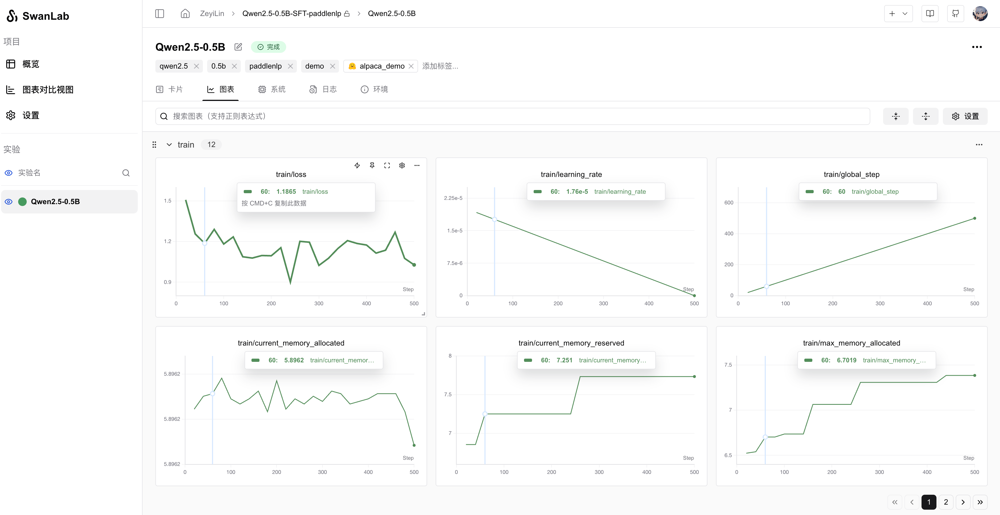

# PaddleNLP

[PaddleNLP](https://github.com/PaddlePaddle/PaddleNLP) 是一款基于飞桨深度学习框架的大语言模型(LLM)开发套件，支持在多种硬件上进行高效的大模型训练、无损压缩以及高性能推理。PaddleNLP 具备简单易用和性能极致的特点，致力于助力开发者实现高效的大模型产业级应用。


你可以使用`PaddleNLP`快速进行模型训练，同时使用SwanLab进行实验跟踪与可视化。

## 1. 引入SwanLabCallback

```python
from swanlab.integration.paddlenlp import SwanLabCallback
```

**SwanLabCallback**是适配于PaddleNLP的日志记录类。

**SwanLabCallback**可以定义的参数有：

- project、experiment_name、description 等与 swanlab.init 效果一致的参数, 用于SwanLab项目的初始化。
- 你也可以在外部通过`swanlab.init`创建项目，集成会将实验记录到你在外部创建的项目中。

## 2. 传入Trainer

```python (1,7,12)
from swanlab.integration.paddlenlp import SwanLabCallback
from paddlenlp.trainer import  TrainingArguments, Trainer

...

# 实例化SwanLabCallback
swanlab_callback = SwanLabCallback(project="paddlenlp-demo")

trainer = Trainer(
    ...
    # 传入callbacks参数
    callbacks=[swanlab_callback],
)

trainer.train()
```

## 3. 完整案例代码

> 需要能连接上HuggingFace服务器下载数据集。

```python {8,19,28}
"""
测试于：
pip install paddlepaddle-gpu==3.0.0 -i https://www.paddlepaddle.org.cn/packages/stable/cu126/
pip install paddlenlp==3.0.0b4
"""
from paddlenlp.trl import SFTConfig, SFTTrainer
from datasets import load_dataset
from swanlab.integration.paddlenlp import SwanLabCallback

dataset = load_dataset("ZHUI/alpaca_demo", split="train")

training_args = SFTConfig(
    output_dir="Qwen/Qwen2.5-0.5B-SFT",
    device="gpu",
    per_device_train_batch_size=1,
    logging_steps=20
    )

swanlab_callback = SwanLabCallback(
    project="Qwen2.5-0.5B-SFT-paddlenlp",
    experiment_name="Qwen2.5-0.5B",
)

trainer = SFTTrainer(
    args=training_args,
    model="Qwen/Qwen2.5-0.5B-Instruct",
    train_dataset=dataset,
    callbacks=[swanlab_callback],
)
trainer.train()
```

## 4. GUI效果展示

超参数自动记录：


指标记录：




## 5 拓展：增加更多回调

试想一个场景，你希望在每个epoch结束时，让模型推理测试样例，并用swanlab记录推理的结果，那么你可以创建一个继承自`SwanLabCallback`的新类，增加或重构生命周期函数。比如：

```python
class NLPSwanLabCallback(SwanLabCallback):    
    def on_epoch_end(self, args, state, control, **kwargs):
        test_text_list = ["example1", "example2"]
        log_text_list = []
        for text in test_text_list:
            result = model(text)
            log_text_list.append(swanlab.Text(result))
            
        swanlab.log({"Prediction": test_text_list}, step=state.global_step)
```

上面是一个在NLP任务下的新回调类，增加了`on_epoch_end`函数，它会在`transformers`训练的每个epoch结束时执行。